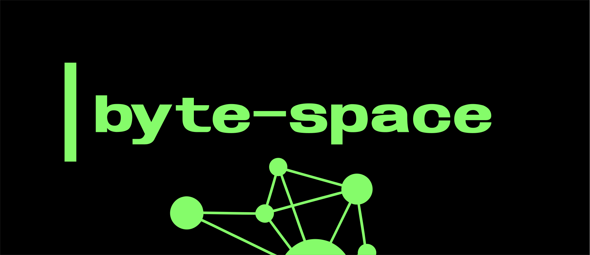

<!-- Logo/Branding - Replace with actual image -->

# byte-space

**Simulating the Early Internet**

)

**Terminal-Based Network Simulation** • **Real-Time Packet Visualization** • **Custom Markup Language**

*Experience the internet circa 1986 — Telnet, FTP, SMTP, and packet tracing*

[Features](#features) • [Quick Start](#quick-start) • [Documentation](#documentation)

---

