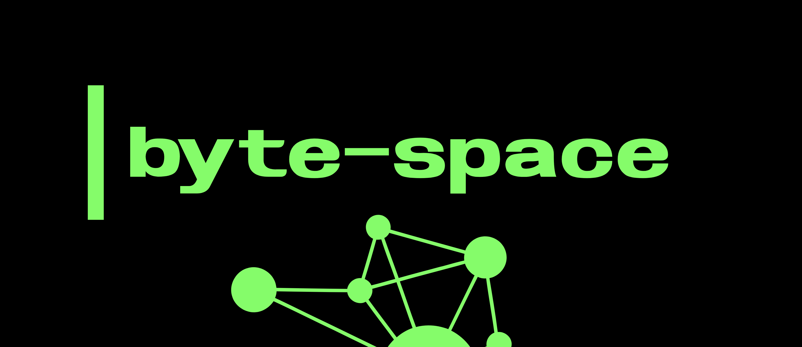

<div align="center">



<br>

# byte-space


**Simulating the Early Internet**

[](https://go.dev)
[](https://opensource.org/licenses/MIT)

**Terminal-Based Network Simulation** • **Real-Time Packet Visualization** • **Custom Markup Language**

_Experience the early internet: Telnet, FTP, SMTP, and packet tracing_

[Installation](#installation) • [Quick Start](#quick-start) • [Features](#features) • [Architecture](#architecture) • [Contributing](#contributing)

---

</div>

Terminal-based internet simulator from the early internet era. Build networks, browse websites in terminals, send email, and watch packets travel in real-time with the visualizer.

## Features

- Virtual Computers - Spawn nodes with their own file system's, shells, TTY's and terminal subsystems
- Network Simulation - Connect machines and watch packets travel between them, routing tables, ip maps, etc.
- Terminal Web Browser - Browse websites rendered in your terminal using a custom terminal based markup language
- Email System - Send mail between virtual machines using SMTP
- Custom Protocols - Built-from-scratch implementations of DNS, Telnet, HTTP, and more
- Packet Visualization - Real-time graphical view of network traffic using Ebiten
- Time Control - Tick-based system with adjustable network speed (instant to slow-motion)
- some more cool stuff

## Installation

### From Source

```bash
git clone https://github.com/Ekansh38/byte-space.git
cd byte-space
go build ./...
```

### Using Go Install

```bash
go install github.com/Ekansh38/byte-space@latest
```

> **Note:** Requires Go 1.21 or higher

## Quick Start

Coming soon.

## Architecture

The system consists of four programs that communicate via Unix domain sockets:

- **Simulation Engine** - Core network simulator managing virtual computers and packet routing
- **Admin CLI** - Create and configure nodes, manage network topology
- **User CLI** - Connect to virtual machines, run commands, browse the network
- **Visualizer** - Real-time packet flow animation

## Contributing

Contributions are welcome! Please feel free to submit a Pull Request.

1. Fork the repository
2. Create your feature branch (`git checkout -b feature/amazing-feature`)
3. Commit your changes (`git commit -m 'Add some amazing feature'`)
4. Push to the branch (`git push origin feature/amazing-feature`)
5. Open a Pull Request

## License

MIT - see [LICENSE](LICENSE) file for details
